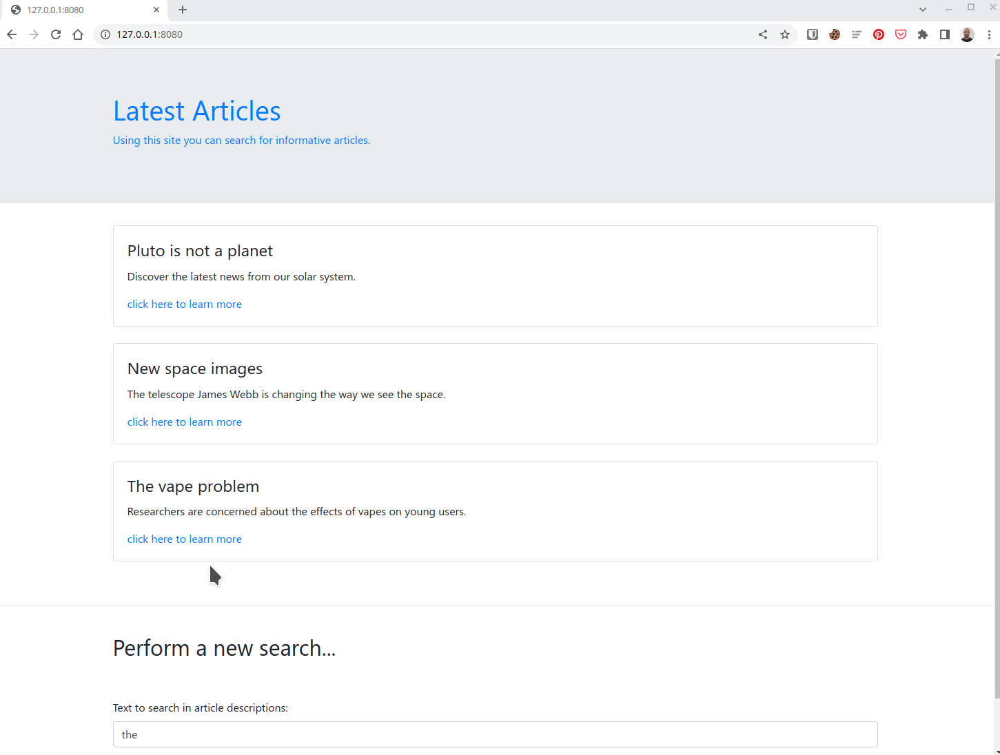

# Python MSSQLi Demo

Hi! This project is a very simple demo of the well known SQL Injection,
using Microsoft SQL Server as the database engine and Flask as the web
provider.

This solution is based on a website with a search form, which is directly
sent as part of a query to MS SQL.


The database contains two tables: one with the articles, which can be viewed
by clicking the search button, and another table called Employees, which
contains the "secrets" that we want to target in our attacks.

The search field receives words and include them in a `SELECT` statement,
returning the corresponding articles.


## 1. Setup

In order to facilitate the execution, the project has been built using Docker Compose.
Ensure it is up and working on your machine before proceeding.

[](https://asciinema.org/a/ERX9dSQV6y0t9zO0kRPFrySi6?autoplay=1)

I am using a Linux Machine (Ubuntu 20.04), but you can use your preferred system, it
should work with no major problems.

- [Setup on Linux](https://docs.docker.com/engine/install/ubuntu/)
- [Setup on Windows](https://docs.docker.com/desktop/install/windows-install/)
- [Setup on Mac OS](https://docs.docker.com/desktop/install/mac-install/)

Download the project from the ZIP file provided by Github or clone the project
using the git URL. Then, enter the directory and start the services using
Docker Compose. The first boot will take longer because Docker will download
and build the container images. You can check the messages in the terminal.

```shell
$ git clone https://github.com/wesleyit/python_mssqli.git
$ cd python_mssqli
$ docker compose up
```

[](https://asciinema.org/a/M7BnEKZHeBzJcWlK7SB3mbEFR?autoplay=1)

[](https://asciinema.org/a/7vWIq6Bw41QdqvcCmgfd20Qho?autoplay=1)

If everything works fine the site will be available at your `http://your_ip:8080`.

## 2. Attacking

First, we will use a simple browser session to manually attack the server.

### 2.1 Discovering which character triggers the injection

The most common chars are single
and double quotes (\' and \"). Try variations. When the right char is inserted, the page will
break, as the query will be incomplete.



### 2.2 Discovering if the attack is reflected on the page, and how many fields are accepted

Try as many parameter as necessary to understand how many parameters the page is expecting.


### 2.3 Discovering the DB Engine, Current DB and available tables

What DB engine is this? Try commands to explore. Each platform has its own commands which can help to identify the DB.

Here we use zzzz' with `UNION` to make the page return only our query, as the parameter zzzz will not match to retults in the original query.

```
zzzz' UNION SELECT 'DB Engine Version:', @@version --

zzzz' UNION SELECT 'DB Name:', DB_NAME() --

zzzz' UNION SELECT TABLE_NAME, 'Available in DB ' + \
    TABLE_CATALOG FROM Secrets.INFORMATION_SCHEMA.TABLES --
```


### 2.4 Querying data from interesting tables

It is time to fetch data from other tables.

```
zzzz' UNION SELECT COLUMN_NAME, '' FROM INFORMATION_SCHEMA.COLUMNS WHERE TABLE_NAME = 'Employees' --

zzzz' UNION SELECT EmployeeName, EmployeePassword FROM Employees --
```


## 3. Automation

There are tools for automating the attack, like OWASP Zed Attack Proxy and SQLMap.
This is SQLMap description found on their website:

> SQLMap is an open source penetration testing tool that automates the process of detecting and exploiting SQL injection flaws and taking over of database servers. It comes with a powerful detection engine, many niche features for the ultimate penetration tester and a broad range of switches lasting from database fingerprinting, over data fetching from the database, to accessing the underlying file system and executing commands on the operating system via out-of-band connections.

## 4. Protection

### Better coding

To avoid being vulnerable is better than protecting or remediating a vulnerable system. There are many frameworks for data handling which checks for SQLi. There are also patterns to deal with objects, mapping application objects to database objects, which reduce the amount of manual code necessary to create components and fetch data.

### WAF

A Web Application Firewall is a Layer 7 (application) firewall able to intercept the HTTP request, inspect the package's content, and then block or allow based on rules. Most WAFs are able to apply TOP-10 OWASP rulesets, which prevents SQLi and other known vulnerabilities.

### Endpoint

Tools analyzing the endpoint behavior can be useful to collect data and help during the analysis, in a modern XDR + SOAR approach.

### DB

There are also tools that monitors the DB instance and collect data about suspicious activity like the ones generated during an SQLi exploration.

## 5. Final Thoughts

The sooner you detect a problem, the less it will cost to fix.
Although it is a good practice to have tools for containing attackers,
like WAF, it is better to mitigate the vulnerabilities by designing
properly the program, thinking in security early, using Threat Modeling,
SAST, DAST, and other techniques that will end up producing a more
dependable software.
